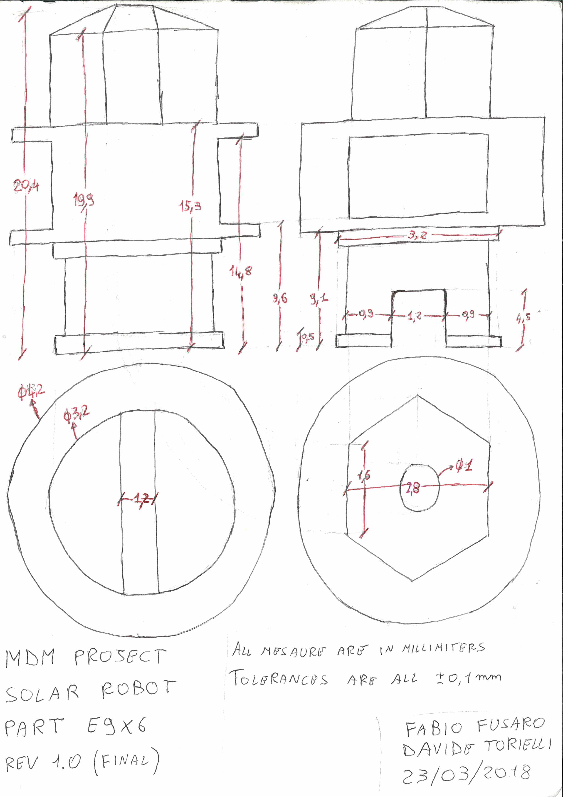
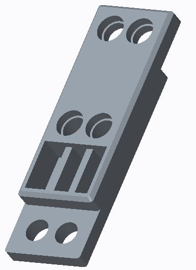
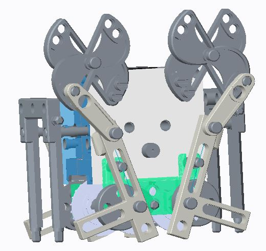
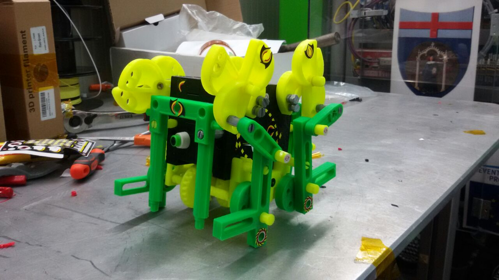

# MechanicalDesignMethodRobEng2017-18
Construction of toy game robot modelling part in Creo and 3D printing them. Robotics Engineering 2018/19 

This project consist in building a toy robot copying from existing one
* "Studying" some parts of the toy, and make sketch of them on paper

    

  
* From drawings, create 3D models with Creo Parametric

    

  
* Assembly the parts and testing the working of the robot with Creo Simulate

    

  
* Prints the part with 3D printer, and assembly the real robot.

    

     

Final video [here](https://streamable.com/99i0z)

## Contributors
* [torydebra](https://github.com/torydebra/)
* [fafux](https://github.com/fafux/)
